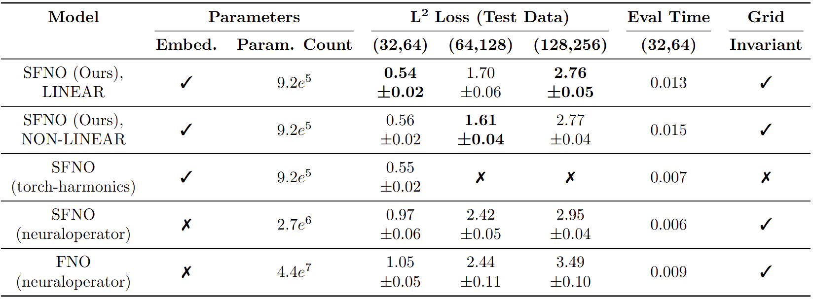
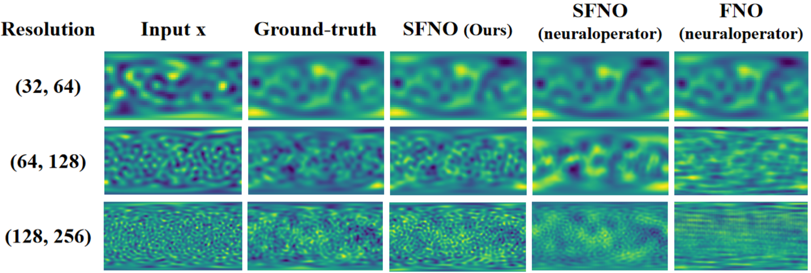
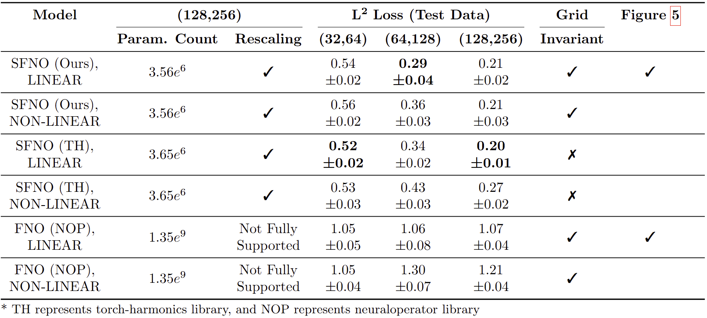
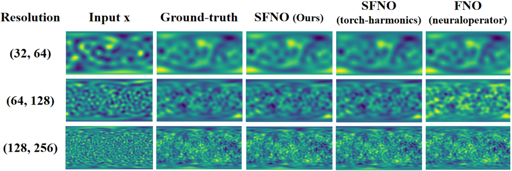
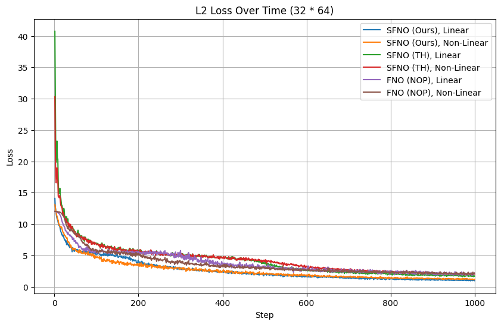
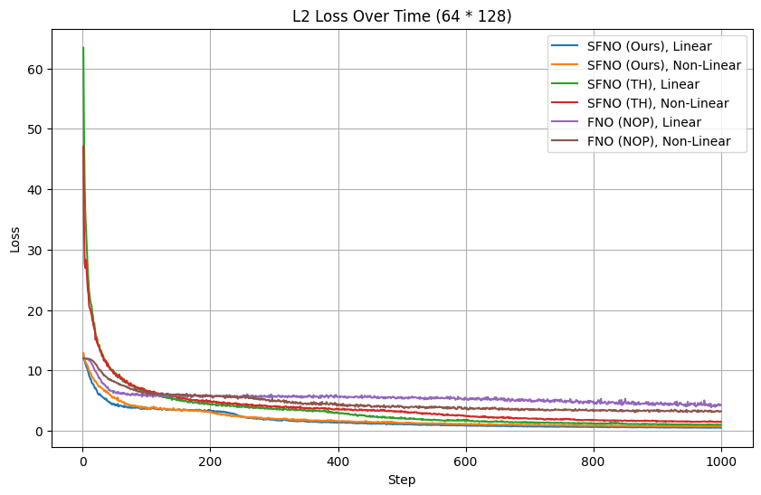
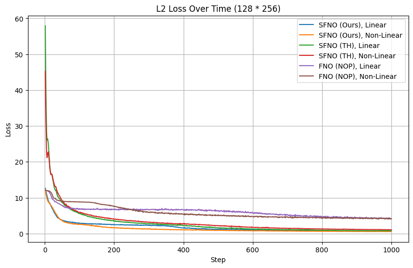

# Modeling Water Flow on the Sphere with FNO

## Introduction
The shallow water equations (SWE) on a rotating sphere is a system of hyperbolic partial differential equations represented by a $N$-dimensional vector $ u(x, t): S^2 \times [0, T) \rightarrow R^N$. The system is observed at discrete times $t_n \in \{t_0,t_1,\cdots\}$ and positions $x_i \in \{x_0,x_1,\cdots,x_N\}$, assuming that there exists a deterministic mapping

$$
u_{n+1} = F[u_{n}, t_n]
$$

which maps the discrete state vector $u_n$ at time $t_n$ to the state $u_{n+1}$. Our aim is to learn this map from data. A better way is to use ReNO, such as SNFO and NFO. The Spherical Fourier Neural Operator (SFNO) offers a promising solution for geophysical fluid dynamics, especially for the SWE, key in modeling atmospheric and oceanic dynamics. SFNO leverages Earth's spherical geometry for more accurate and efficient predictions than FNO.


## File Description
```plaintext
SFNO_Shallowwater/
├── sfno_implement/         # Our implemented SFNO
├── baseline_implement/     # Implementation of Baseline
├── tools/                  # Store the drawing tools
├── test_dataset/           # Store the input and labels
└── script                  # Store the output results
```


## Spherical Fourier Neural Operators Implementation

#### Convolutions on the Sphere
The spherical convolution admits a convolution theorem of the form

$$
\mathcal{F}[\kappa \star u](l, m) = 2\pi \sqrt{\frac{4\pi}{2l + 1}} \, \mathcal{F}[u](l, m) \cdot \mathcal{F}[\kappa](l, 0),
$$

where $\mathcal{F}$ refers to the Spherical Harmonic Transform (SHT). By replacing the filter weights $\mathcal{F}[\kappa](l, 0)$ with the learned weights $\kappa_\vartheta(l)$, we obtain the Spherical Fourier Neural Layer

$$
\mathcal{K}_{\vartheta}[u] = \mathcal{F}^{-1}[\tilde{\kappa}_{\vartheta} \cdot \mathcal{F}[u]],
$$

The above theory is implemented in the **SphericalConv** class. Using $\mathcal{F}$ and $\mathcal{F}^{-1}$ involves **RealSHT** and **InverseRealSHT** modules from **torch-harmonics**. We initialize parameter $\vartheta$ with **nn.Parameter** and use **torch.einsum** for $\tilde{\kappa}_{\vartheta} \cdot \mathcal{F}[u]$. It is worth mentioning that the code implemented in the **torch-harmonics** library is resolution-dependent because it initializes **RealSHT** and **InverseRealSHT** during setup. These Fourier operators lack learnable weights and must adjust to the resolution during forward propagation. Thus, we combined methods from the **neuraloperator** library to optimize the process and make it resolution-independent. However, the **neuraloperator** library has its limitations, and we will discuss it below.

#### SFNO Network

**SFNO Block:** According to the article, MLPs act point-wise in the spatial domain for channel mixing. The Spherical Fourier Neural Layer implements convolutions on the sphere to learn long-range spatial dependencies. The first MLP output and Spherical Fourier Neural Layer output are added and input to the second MLP, which is skip-connected to the initial input. We implement it in the **SFNO\_Block** class. Moveover, we use **nn.Conv2d** instead of **nn.Conv1d** in MLPs for better optimization.

**Overall SFNO Architecure:** According to the article, encoder and decoder MLPs inflate the channel dimension. A learned position embedding is added for position-dependent information. The core has N SFNO blocks, with the first and last for scaling. A skip connection is added for autoregressive maps. We implement it in the **SFNO** class, with encoder and decoder networks as point-wise MLPs (**nn.Conv2d**) with **GELU** activations. The model is grid-invariant except for position embeddings, however, position embeddings can be parameterized with spherical harmonics, becoming grid-invariant. The **torch-harmonics** library lacks, so we add it in our code. Moveover, the first and last blocks' scaling in **neuraloperator** library is inadequate, and we improve it in our code.

#### Baseline Implementation

For the baseline neural operator, we follow the experimental settings in the paper, using FNO in the **neuraloperator** library for comparative experiments. We also compare the SFNO implementation with those in the **torch-harmonics** and **neuraloperator** libraries.


## Experimental Setup

#### SWE Dataset

Training data for the SWE is generated by randomly initializing conditions and using a classical solver. The initial geopotential height and velocity fields are Gaussian random fields on the sphere. This can be generated with the **loads\_pherical\_swe** function in the **neuraloperator** library.

#### Loss Function

We follow the experimental settings in the paper, using L2 loss implemented in the LpLoss class with $p=2$. The article also mentioned using autoregressive loss for finetuning, but our experiments show only a 1%-2% impact on the final results. Due to space constraints, we doesn't include this part of the experiment.

#### SFNO and Baseline Training Setting

We conduct two comparative experiments. In the first experiment, we train five models, including our own implementation and those included in the library, as seen in Table 1. The models are trained with 4 (S)FNO blocks, a downscaling factor of 3, and an embedding dimension of 32. The **torch-harmonics** library fails to achieve grid-invariance as mentioned before. The second experiment compare six models, as seen in Table 1. We modify the library's code to use the **ComplexRelu** class for nonlinear mappings in the frequency domain. The training data resolutions are both 32x64, 64x128, and 128x256, and the test data had matching resolutions. This experiment aims to see its performance when the resolution of the training data and test data is the same. Our training is on GeForce RTX 3080, setting the training batchsize to 10, and train for a total of 20 rounds.


## Result

<div align="center">

</div>

<div align="center">

</div>

In the first experiment, as shown in Table 1, our implemented SFNO outperforms the baseline and produces results similar to the SFNO effect of the **torch-harmonecs** library. Figure 1 illustrates that SFNO clearly surpasses FNO, because FNO shows **artifacts** in its predictions. However, the SFNO effect from the **neuraloperator** library is subpar, likely due to poor implementation of position embedding and other factors. Additionally, the **torch-harmonecs** library fails to achieve grid-invariance. It is worth mentioning that the parameters we count are learnable parameters, and adding a nonlinear layer in the frequency domain will not bring about changes in the learnable parameters.


<div align="center">

</div>

<div align="center">

</div>

In the second experiment, we decide not to compare the SFNO effect of the **neuraloperator** library, as it had shown suboptimal performance in the first experiment and space is limited. Table 2 demonstrates that the SFNO predictions from both our implementation and the **torch-harmonecs** library are better than FNO. Additionally, adding nonlinear layers in the frequency domain did not alter the learnable parameters. In addition, neuraloperator library does not fully support rescaling, making its parameter count very large. As illustrated in Figure 2, we observe artifacts at the boundaries predicted by FNO, whereas SFNO provides superior predictions. Furthermore, Figure 3 shows that SFNO achieves a lower loss value than FNO upon training convergence. The test results, including mean and standard deviation, confirm that SFNO outperforms FNO in SWE prediction. The data in the Table 2 shows the worst prediction, best prediction and average situation during prediction.


  


## References

[1] [GitHub - NVIDIA/torch-harmonics: Differentiable signal processing on the sphere for PyTorch](https://github.com/NVIDIA/torch-harmonics)

[2] [GitHub - neuraloperator/neuraloperator: Learning in infinite dimension with neural operators](https://github.com/neuraloperator/neuraloperator)